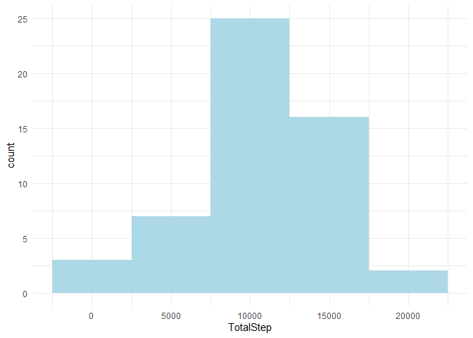
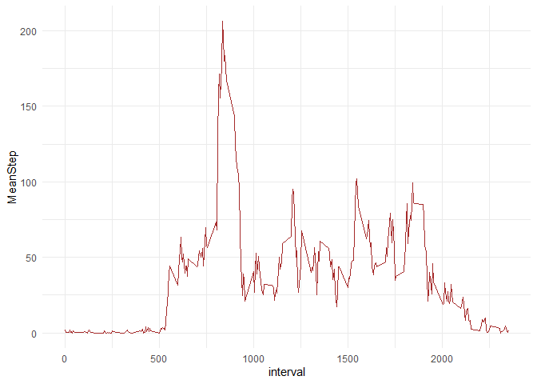
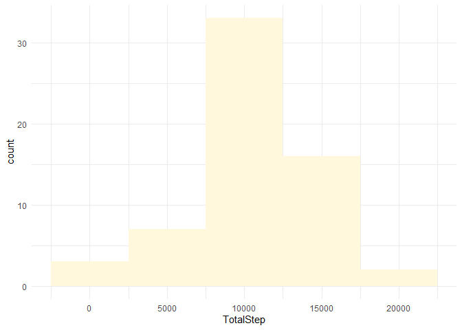
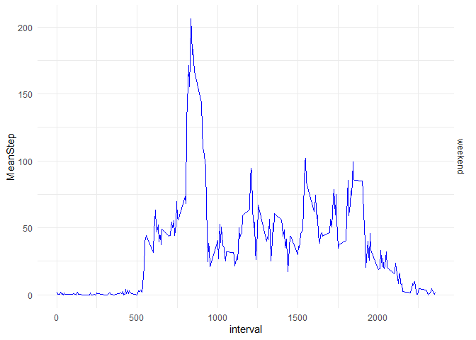

## Loading and preprocessing the data
Load data into 'data' and change date variable to date type


```r
library('tidyverse')
```

```
## -- Attaching packages --------------------------------------- tidyverse 1.3.1 --
```

```
## v ggplot2 3.3.5     v purrr   0.3.4
## v tibble  3.1.3     v dplyr   1.0.7
## v tidyr   1.1.3     v stringr 1.4.0
## v readr   2.0.0     v forcats 0.5.1
```

```
## -- Conflicts ------------------------------------------ tidyverse_conflicts() --
## x dplyr::filter() masks stats::filter()
## x dplyr::lag()    masks stats::lag()
```

```r
data <- read.csv('activity.csv')
data <- data %>% mutate(date = as.Date(date, '%Y-%m-%d'))
```

## What is mean total number of steps taken per day?
Create new data frame 'activity', calculate total steps per day  
Create histogram as per instruction


```r
activity <- data %>%
  group_by(date) %>%
  summarise(TotalStep = sum(steps))

ggplot(activity, aes(TotalStep)) + geom_histogram(binwidth = 5000, fill = 'lightblue') +
  theme_minimal()
```

```
## Warning: Removed 8 rows containing non-finite values (stat_bin).
```

<!-- -->

```r
mean1 <- mean(activity$TotalStep, na.rm = TRUE)
median1 <- median(activity$TotalStep, na.rm = TRUE)
```

mean of total steps per day = 1.0766189\times 10^{4}  
median of total steps per day = 10765

## What is the average daily activity pattern?
Create new data frame 'activity2' and calculate mean step taken for each interval then
plot it as a time series plot  
Then look for interval which has maximum mean of steps taken


```r
activity1 <- data %>%
  group_by(interval) %>%
  summarise(MeanStep = mean(steps, na.rm = TRUE))

ggplot(activity1, aes(interval, MeanStep)) + geom_line(col = 'brown') + theme_minimal()
```

<!-- -->

```r
which.max(activity1$MeanStep)
```

```
## [1] 104
```

```r
act <- activity1[104, 1]
```

Interval with highest average steps taken is 835

## Imputing missing values
Calculate number of missing value in the dataset

```r
missing <- sum(is.na(data$steps))
```
No.of missing value = 2304  
Plan for impute missing value by using mean for that interval rounded down
Create new dataset

```r
##Create floormeaninterval factor (store mean step for each interval rounded down, as integer)
floormeaninterval <- as.integer(floor(activity1$MeanStep))

##Impute missing value and create new dataset called 'newdata'
newdata <- data %>%
  cbind(floormeaninterval) %>%
  mutate(steps = if_else(is.na(steps), true = floormeaninterval, false = steps))
```

Make a new histogram, calculate mean and median of Total step per day for the new dataset


```r
activity2 <- newdata %>%
  group_by(date) %>%
  summarise(TotalStep = sum(steps))

ggplot(activity2, aes(TotalStep)) + geom_histogram(binwidth = 5000, fill = 'cornsilk') +
  theme_minimal()
```

<!-- -->

```r
mean2 <- mean(activity2$TotalStep)
median2 <- median(activity2$TotalStep)
```

mean of total steps per day = 1.074977\times 10^{4}  
median of total steps per day = 10641  
These new values are lower than original with NA value because I use the rounded down mean for interval, it does not make much impact on the overall data

## Are there differences in activity patterns between weekdays and weekends?
Create new factor variable, mutate new column called 'day' to identify which date is weekday/weekend  
Then plot new graph with average step for intervals comparing weekday and weekend


```r
weekday <- c("Monday", "Tuesday", "Wednesday", "Thursday", "Friday")

newdata <- newdata %>%
  mutate(day = if_else(weekdays(date) %in% weekday, 'weekday', 'weekend'))

activity3 <- newdata %>%
  group_by(interval, day) %>%
  summarise(MeanStep = mean(steps))
```

```
## `summarise()` has grouped output by 'interval'. You can override using the `.groups` argument.
```

```r
ggplot(activity3, aes(interval, MeanStep, day)) + geom_line(col = 'blue') + theme_minimal() +
  facet_grid(day~.)
```

<!-- -->

